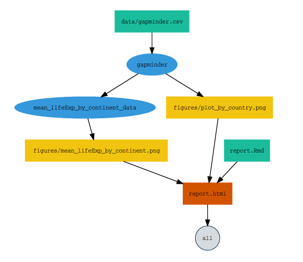

### Tutorial for remake

This is a use case and tutorial for the R package **remake**

The [remake package](https://github.com/richfitz/remake) is "Make-like build management, reimagined for R". Using the package allows you to:

- Change parts of your workflow and only update what changed
- Make your workflow reproducible since it incorporates the data importing, analysis and reporting in the same piepeline

This tutorial will assume you have a working understanding of the following topics:

- The `gapminder` dataset
-  Writing functions in R
-  Generating plots using `ggplot2`
-  Using the `dplyr` package for data manipulation

If you need a refresher on any of these topics, a great resource that covers them is provided by [Data Carpentry](http://www.datacarpentry.org/R-ecology-lesson/).  We will also use [`rmarkdown`](http://rmarkdown.rstudio.com/authoring_quick_tour.html) to generate a PDF report from our R code.

The example uses Jenny Bryan's excerpt of the Gapminder data. The
data is available as an [R package](https://github.com/jennybc/gapminder)
and is also available as CSVs file in this repository in the **data** directory.
Generally the data is a global survey, every 5 years, of country, continent, year, 
life expectancy at birth, total population and gdpPercap.

In this use case, we will 

- pose questions we want to ask 
- determine the data we need to use
- determine the plots and analyses needed to answer those questions
- write R code to generate these plots and analyses
- write the YAML file required for remake

### Questions

- Are there differences in the life expectancy trends over time by continent?
- How do the trends in life expectancy differ between 4 countries in Africa?

- We have new data starting in 1985. After the data from 1985 to 2012 is added, 
are there changes in trends?

### Data

We had the Gapminder data through 1985 and did the analysis. Then our collaborator
sent us the data from 1985 to 2102. So, we have two files:

**gapminder1952-1977.csv** - Gapminder data from 1952 to 1977

**gapminder1982-2007.csv** - Gapminder data from 1982 to 2007

### Remake components 

In order to create your workflow you need to describe the beginning, intermediate and end points of your analysis, and how they flow together. These steps are called the targets, rules and dependencies on `remake`.

- "Targets": What are you going to generate. These can be files or R objects. 

-  "Rules": How are you going to generate your targets. What functions do you need?

- "Dependencies": What do you need to generate your targets. These may be other targets that you need for a particular target. Bear in mind that you might have several intermediate targets to produce your final target.


### Targets

Targets are anything we need to produce at the end and throughout the pipeline

- the first target we need is the data frame of the imported csv
- the next target we need is the the transformed data frame
- a plot of average life expectancy per continent over time
- a plot of life expectancy for the 4 countries over time
- the last target is the rendered html output 

### Rules

The rules are the commands that you need to use to create all your targets. You can create an R file with all the functions you are going to use.

### YAML file

The yaml file tells remake everything that needs to know. 

At the beginning of your YAML file you need to write the packages and you need to source the functions for your rules.

```{yaml}
packages:
  - dplyr
  - ggplot2
  - rmarkdown

sources:
  - R/function.R
```

After setting up what remake needs we can start defining our targets. 

The `all` target is the final output. In this case we are creating an hmtl report.

In order to create this report, we need first to import the data. In this case the target is gapminder and the rule is `read.csv`. 

```{yaml}
packages:
  - dplyr
  - ggplot2
  - rmarkdown

sources:
  - R/function.R

targets:
  all:
    depends:
      - report.html

  gapminder:
    command: read.csv(file = "data/gapminder.csv")
```

The next targets we need is our transformed data frame and the plots. The rules for the plots are the plotting functions we defined in the function file.


```{yaml}
packages:
  - dplyr
  - ggplot2
  - rmarkdown

sources:
  - R/function.R

targets:
  all:
    depends:
      - report.html

  gapminder:
    command: read.csv(file = "data/gapminder.csv")

  mean_lifeExp_by_continent_data:
    command: mean_lifeExp_by_continent(gapminder)

  figures/mean_lifeExp_by_continent.png:
    command: plot_mean_lifeExp(mean_lifeExp_by_continent_data)

  figures/plot_by_country.png:
    command: plot_by_country(gapminder, I(countries = c("South Africa", "Morocco", "Algeria", "Nigeria")))
```

Finally we want to create the output which is the hmtl report. With `remake` you can define implicit and explicit dependencies. 
If your target depends on more than one object, you can list all the dependencies to make sure that the target gets remade every time any of the dependencies changes. 


```{yaml}
packages:
  - dplyr
  - ggplot2
  - rmarkdown

sources:
  - R/function.R

targets:
  all:
    depends:
      - report.html

  gapminder:
    command: read.csv(file = "data/gapminder.csv")

  mean_lifeExp_by_continent_data:
    command: mean_lifeExp_by_continent(gapminder)

  figures/mean_lifeExp_by_continent.png:
    command: plot_mean_lifeExp(mean_lifeExp_by_continent_data)

  figures/plot_by_country.png:
    command: plot_by_country(gapminder, I(countries = c("South Africa", "Morocco", "Algeria", "Nigeria")))

  report.html:
    depends:
      - figures/mean_lifeExp_by_continent.png
      - figures/plot_by_country.png
    command: render("report.Rmd")

```


### Running remake

Go to the working directory where the YML file is

On the console install and load remake

**Install and load the libraries**

```{r}
install.packages("devtools")
devtools::install_github("richfitz/remake")
library(remake)
```

**Run make**

On the console run `make`

```{r}
make()
```

### Diagram your pipeline

**Install and load the libraries**

```{r}
devtools::install_github('rich-iannone/DiagrammeR')
library(DiagrammeR)
```

You can diagram your whole pipeline using the `diagram()` function.

Our current pipeline looks like this:




### R Markdown file

In the RMarkdown file, the R code

- imports the data
- has a function that transforms the data for the analysis
- has a function that plots the life expectancy for 4 countries over time
- imports a plot of average life expectancy per continent over time that
was generated with another R script
