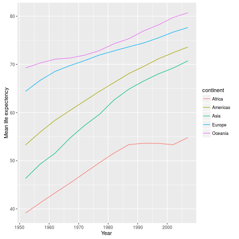
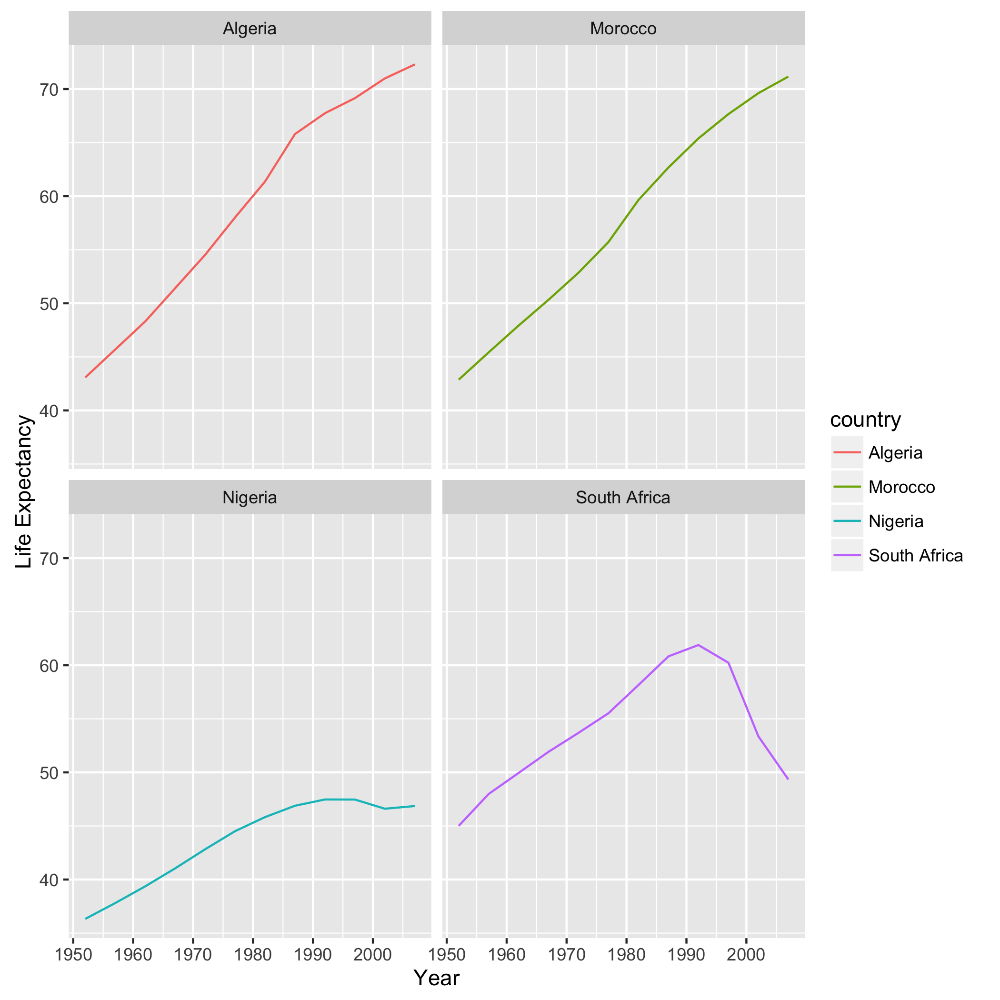

What are the trends in life expectancy between the years 1952 - 1982 for each continent?

How do these trends in life expectancy vary across the following four countries over the years 1952 - 1982?

